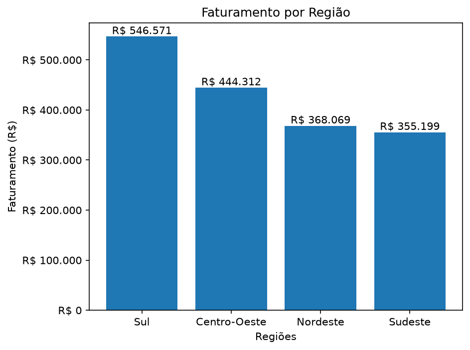
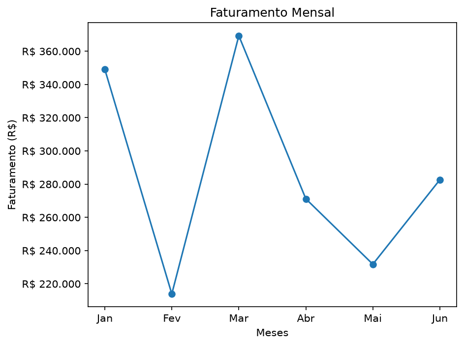
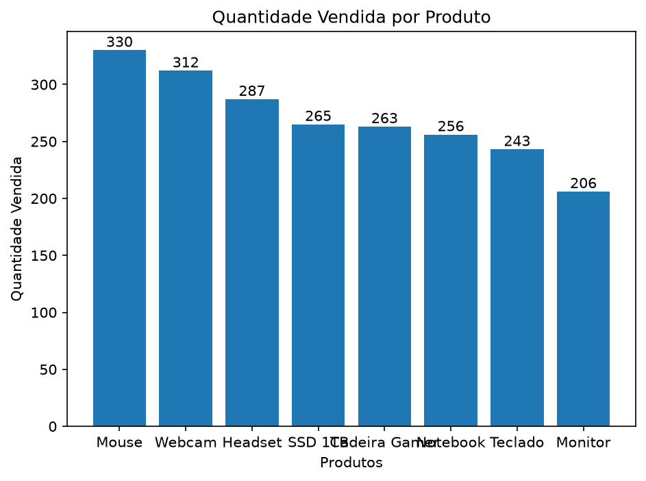

# Análise Comercial com pandas e PostgreSQL

Projeto de análise de dados comerciais desenvolvido com Python, com o objetivo de contruir um pipeline completo, começando dos dados brutos de vendas até análises comerciais e visualização.

O objetivo possui o tratamento e validação de dados, análise exploratória, persistência em PostgreSQL, consultas SQL, controle de acesso ao banco, testes automatizados e visualização com Matplotlib.

## Objetivo

O projeto foi transformar uma base bruta de vendas em informações mais úteis a equipe, para com isso responder perguntas de negócio, como:

- Qual é o faturamento total?
- Quais produtos vendem mais?
- Qual a região gera maior faturamento?
- Como o faturamento evolui ao longo dos meses?
- Qual o vendedor apresenta maior faturamento?
- Como quantidade, preço e descontos se relacionam com as variações de faturamento?

## Pipeline do projeto

```text
CSV bruto
   ↓
Carregamento
   ↓
Diagnóstico dos dados
   ↓
Tratamento e validação
   ↓
Análise comercial
   ├── Python / Pandas
   ├── SQL / PostgreSQL
   └── Matplotlib
   ↓
Dados tratados + indicadores + gráficos
```

## Tratamento de dados

Foram encontrados alguns problemas durante a análise da base como:

- registros duplicados;
- valores ausentes;
- quantidades negativas;
- preços negativos;
- descontos fora do intervalo esperado;
- inconsistências em campos textuais.

Tivemos regras de tratamento mais conservadoras, evitando substituir valores sem uma justificativa hipotética de negócio.

Entre as principais decisões:

- remoção de registros completamente duplicados;
- quantidades negativas convertidas para valores ausentes;
- preços negativos convertidos para valores ausentes;
- descontos fora do intervalo de 0 a 1 convertidos para valores ausentes;
- padronização de campos textuais;
- conversão adequada dos tipos de dados.

O faturamento foi calculado através da regra:

```text
faturamento = quantidade × preco_unitario × (1 - desconto)
```

Após o tratamento, a base ficou com **500 registros**, sendo **495 registros com faturamento calculável**.

## Principais resultados

O faturamento calculável da base foi de aproximadamente **R$ 1,72 milhão**.

Entre os resultados encontrados:

- **Mouse** foi o produto com maior quantidade vendida, com 330 unidades;
- **Monitor** apresentou a menor quantidade entre os produtos identificados, com 206 unidades;
- a região **Sul** apresentou o maior faturamento entre as regiões identificadas, com aproximadamente R$ 546,6 mil;
- **Rafael** apresentou o maior faturamento entre os vendedores, com aproximadamente R$ 344,1 mil.

A análise temporal também mostrou variações relevantes de faturamento entre os meses.

Entre fevereiro e março, por exemplo, o faturamento passou de aproximadamente **R$ 213,9 mil para R$ 369,3 mil**. No mesmo período houve aumento da quantidade vendida e do preço unitário médio, enquanto o desconto médio apresentou uma pequena redução.

Esses resultados representam associações observadas nos dados e não, isoladamente, relações de causa e efeito.

## Visualizações

### Faturamento por região



### Evolução do faturamento mensal



### Quantidade vendida por produto



## PostgreSQL e SQL

Após o tratamento em Python, os registros são preparados e enviados para um banco PostgreSQL.

A tabela utiliza `id_venda` como chave primária e possui restrições para ajudar a preservar a integridade dos dados.

As consultas SQL foram utilizadas para validar e complementar as análises realizadas em Pandas, incluindo:

- faturamento total;
- faturamento por região;
- faturamento por vendedor;
- produtos mais e menos vendidos;
- faturamento mensal;
- quantidade mensal;
- preço unitário médio;
- desconto médio.

Os resultados de faturamento obtidos através de SQL foram comparados com os resultados calculados em Pandas como forma adicional de validação.

## Segurança

As credenciais do PostgreSQL são armazenadas em variáveis de ambiente através de um arquivo `.env`, que não é versionado pelo Git.

O projeto inclui um `.env.example` apenas com a estrutura necessária para configuração.

Também foi criado um usuário específico para a aplicação seguindo o princípio de menor privilégio.

O usuário da aplicação possui somente:

```text
SELECT
INSERT
```

Operações como `UPDATE` e `DELETE` não são permitidas para esse usuário.

## Testes

Foram adicionados testes automatizados com Pytest para algumas das principais regras de negócio do tratamento.

Os testes verificam:

- tratamento de quantidade negativa;
- cálculo de faturamento;
- remoção de registros duplicados.

Para executar:

```bash
python -m pytest
```

## Estrutura

```text
Python_Proj_02/
│
├── dados/
│   ├── vendas_brutas.csv
│   └── vendas_tratadas.csv
│
├── graficos/
│   ├── faturamento_regiao.png
│   ├── faturamento_mensal.png
│   └── quantidade_produto.png
│
├── sql/
│   ├── 01_criar_tabela.sql
│   ├── 02_analises.sql
│   └── 03_permissoes.sql
│
├── src/
│   ├── tratamento.py
│   ├── analise.py
│   ├── banco.py
│   └── visualizacao.py
│
├── tests/
│   └── test_tratamento.py
│
├── main.py
├── requirements.txt
├── .env.example
├── .gitignore
└── README.md
```

## Tecnologias utilizadas

- Python
- Pandas
- PostgreSQL
- SQL
- Psycopg
- Matplotlib
- Pytest
- Git
- GitHub

## Executando o projeto

Clone o repositório e crie um ambiente virtual:

```bash
python -m venv .venv
```

Ative o ambiente e instale as dependências:

```bash
pip install -r requirements.txt
```

Crie um arquivo `.env` baseado no `.env.example`:

```text
DB_HOST=localhost
DB_PORT=5432
DB_NAME=analise_comercial
DB_USER=app_vendas
DB_PASSWORD=sua_senha
```

O banco e a tabela podem ser preparados utilizando os scripts disponíveis na pasta `sql/`.

Depois execute:

```bash
python main.py
```

## Aprendizados

Este projeto foi desenvolvido para praticar um fluxo de análise de dados mais próximo de um cenário real, indo além da criação de indicadores isolados.

Durante o desenvolvimento foram trabalhados conceitos de:

- tratamento e qualidade de dados;
- definição de regras de negócio;
- análise com Pandas;
- consultas SQL;
- integração entre Python e PostgreSQL;
- controle de acesso ao banco;
- testes automatizados;
- organização modular do código;
- visualização de dados;
- controle de versão com Git e GitHub.

O projeto também reforçou a importância de investigar anomalias antes de simplesmente remover ou alterar registros e de separar observações encontradas nos dados de conclusões causais.